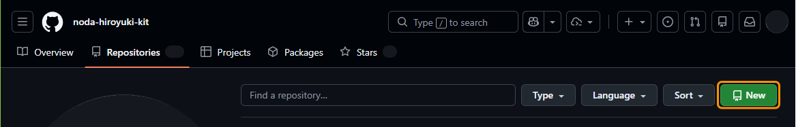
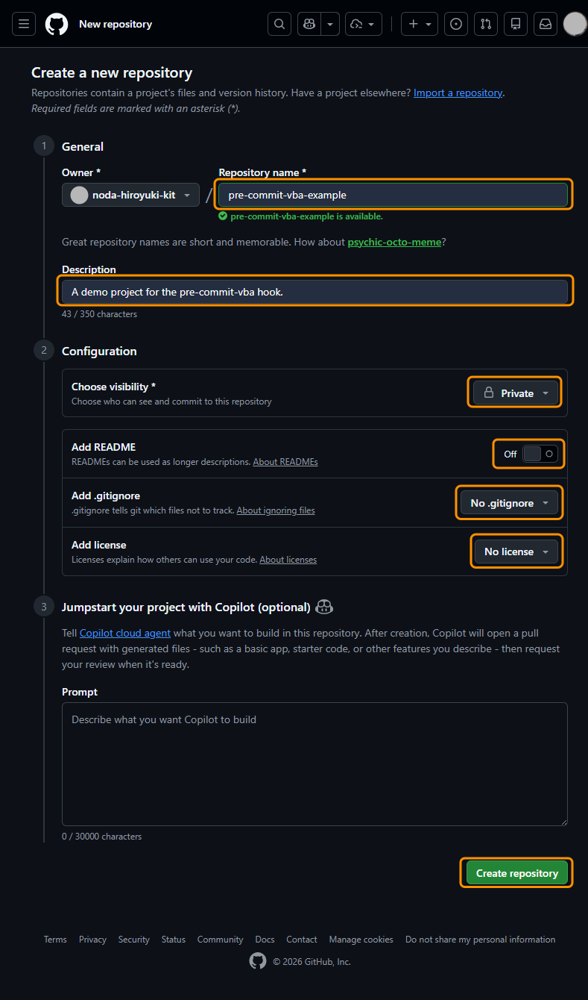

# リモートリポジトリの作成 { #create-a-remote-repository }

## 目的 { #objective }

GitHub に空のリポジトリを作成します.  
この後の手順の土台になります.

## 手順 { #steps }

1. GitHub の組織またはプロフィールを開きます.
2. `Repositories` をクリックします.  
   
3. `New` をクリックします.  
   
4. 次の値を入力します.

    - Repository name: `pre-commit-vba-example`
    - Description: `A demo project for pre-commit-vba`
    - Visibility: `Private`
    - Add README: `Off`
    - Add .gitignore: `None`
    - Add license: `None`

5. `Create repository` をクリックします.  
   {width="650"}

## 確認ポイント { #checkpoints }

- リポジトリトップが表示される.
- 初期ファイルが 0 件で表示される.
- URL が `pre-commit-vba-example` で終わる.

## 補足 { #supplement }

同名リポジトリがある場合は作成できません.  
その場合は名前を変更して再作成してください.
